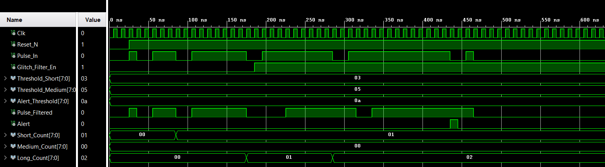

# Digital Pulse Detection & Classification System

## 🎯 Project Overview
The objective of this project is to design and implement a robust digital system capable of detecting, filtering, and categorizing incoming pulses based on their duration. This system is particularly useful in environments where input signals are noisy or where specific pulse-width modulation (PWM) signatures need to be identified.

## 🧠 Logic & Functionality
The system operates in two main stages:

### 1. Glitch Filtering
Before classification, the raw input signal passes through a **Glitch Filter**. If the pulse width is shorter than a predefined threshold (`Threshold_Short`), it is treated as noise and suppressed. This ensures the accuracy of the counters in the next stage.

### 2. Pulse Classification
Valid pulses (those that pass the filter) are measured and categorized into four states:
*   **Short:** Duration equal to the short threshold.
*   **Medium:** Duration between short and medium thresholds.
*   **Long:** Duration between medium and alert thresholds.
*   **Alert:** Any pulse exceeding the maximum safety duration triggers an immediate alert signal.

## 📟 Hardware Modules
*   `Glitch_Filter.vhd`: Handles signal debouncing and noise suppression.
*   `Main.vhd`: The top-level controller that manages time measurements and classification counters.
*   `TB_Main.vhd`: Comprehensive testbench for timing verification.

## 📈 Simulation Result
The following waveform demonstrates the system's ability to filter out glitches and correctly increment the `Medium_Count` and `Long_Count` registers.

## 🛠 Technical Specifications
*   **Input Frequency:** Synchronous with the system clock.
*   **Resolution:** 8-bit counters for each classification.
*   **Control:** Real-time enable/disable for the glitch filter.
